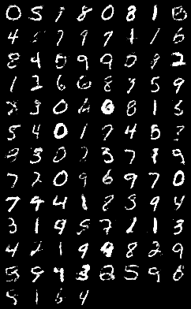

# pytorch-mnist-GAN
This is the practice for GAN using the MNIST data set.
I referenced this [GitHub Link](https://github.com/lyeoni/pytorch-mnist-GAN).

## Results
|  
 0 epochs 
 |  
After 100 epochs
 |  
After 200 epochs
 | 
After 300 epochs
 |
|:--------:|:--------:|:--------:|:--------:|
| |  || |
